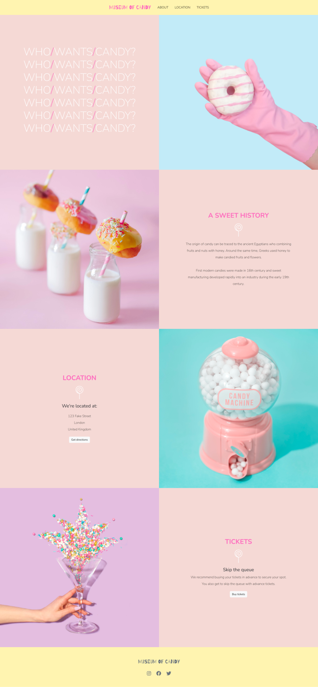
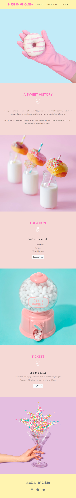
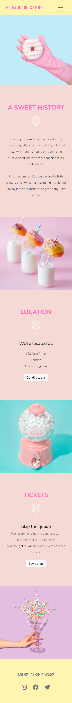

# Colt Steele's Web Development Bootcamp - Museum of Candy

This is my solution to the "Museum of Candy" challenge from Colt Steele's Web Development Bootcamp.

## Table of contents

- [Overview](#overview)
  - [Screenshots](#screenshots)
  - [Links](#links)
- [My process](#my-process)
  - [Built with](#built-with)
  - [Useful resources](#useful-resources)
- [Author](#author)

## Overview

A simple project to practise Bootstrap 5.

### Screenshots

#### Desktop

#### Tablet

#### Mobile

### Links

- [Live Site]()

## My process

### Built with

- Bootstrap 5
- CSS custom properties
- Flexbox
- Font Awesome

### Useful resources

- [Bootstrap Docs](https://getbootstrap.com/docs/5.2)

## Author

- Amparo 💀 - [Say hello 😀](mailto:hello@amparo.ooo?subject=Hello%20from%20GitHub)
- Frontend Mentor - [@amparoamparo](https://www.frontendmentor.io/profile/amparoamparo)
- freeCodeCamp - [@amparo](https://freecodecamp.org/amparo)
- GitHub - [@amparoamparo](https://www.github.com/amparoamparo)
